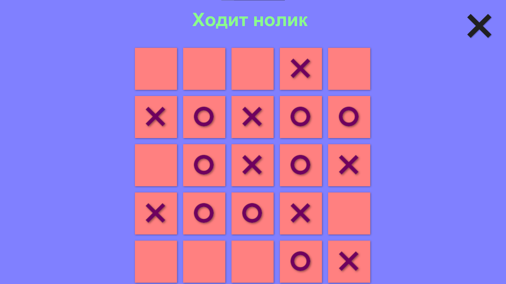

# TicToe — мини‑игра на Unity

> Крестики‑нолики» в формате 5×5 с условием победы 4 в ряд. Проект показывает работу с игровыми состояниями, ECS и UI в Unity.

## Особенности
- Чистая логика
- Понятный UI и быстрый перезапуск игры
- Код легко расширить 

## Стек
- Leo ECS
- C#
- Unity UI
- Unity 6000.0.32f1

## Архитектура 
- ECS: сущности поля, компоненты состояния ячейки, системы хода/проверки победы.
- Game State: переходы между стартом, ходами, финалом партии.
- UI Layer: отображение текущего состояния и кнопка рестарта.
